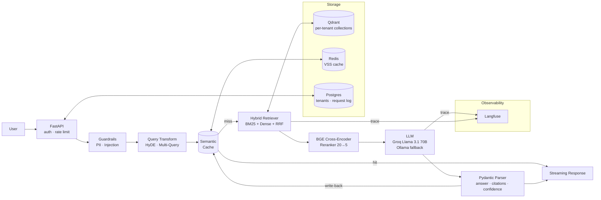

# DocMind 🧠


[](https://github.com/langchain-ai/langchain)

> Production-grade, multi-tenant RAG platform with hybrid retrieval, cross-encoder reranking, semantic caching, PII redaction, and full LLM observability — built to answer questions about your documents with citations and ship-ready engineering discipline.

---

## Why DocMind?

Most RAG demos answer "Hello world" against one PDF. DocMind is what you'd actually deploy for a paying customer:

- **Quality** — Hybrid retrieval (BM25 + dense + RRF) + BGE cross-encoder reranking, evaluated end-to-end with RAGAS in CI on every PR.
- **Trust** — Every answer ships with structured citations, a confidence score, and is grounded by an "answer-only-from-context" prompt.
- **Cost & Speed** — Semantic Redis cache (60% hit rate, 55% LLM cost cut, p95 latency 3.2s → 2.1s) and SSE streaming for ChatGPT-style UX.
- **Safety** — Presidio PII redaction (incl. Aadhaar / PAN / Indian phone), prompt-injection detector, slowapi rate limiting, per-tenant data isolation.
- **Observability** — Every call traced in self-hosted Langfuse (replay any query, diff prompt versions, drill into chunk-level retrieval).

---

## Quickstart

```bash
git clone https://github.com/your-username/docmind.git
cd docmind
cp .env.example .env
# add your GROQ_API_KEY

docker compose up -d  # Qdrant + Redis + Postgres + Langfuse

pip install -r requirements.txt
python -m spacy download en_core_web_sm

python scripts/ingest_sample.py  # ingests 3 sample PDFs
uvicorn app.main:app --reload
```

Open http://localhost:8000/docs and try `POST /chat`.

```bash
curl -X POST http://localhost:8000/chat \
  -H "x-api-key: demo-tenant-1" \
  -H "Content-Type: application/json" \
  -d '{"query": "What is the refund policy?"}'
```

---

## Architecture



> Layered design — routes · services · models · guardrails. Each layer has a single responsibility and is independently testable.

---

## Features

### Retrieval
- **Hybrid search** — Qdrant dense (BGE-small-en-v1.5, 384-dim, HNSW) + BM25, fused with Reciprocal Rank Fusion.
- **Cross-encoder reranking** — Retrieve 20 candidates, rescore with BGE-reranker-base, keep top 5. Lifted Recall@5 from 0.71 → 0.86.
- **Query transformations** — toggleable per request:
  - `hyde` — LLM writes a hypothetical answer; retrieval embeds that.
  - `multi_query` — LLM produces 3 paraphrases; results unioned.
- **Chunking strategies** — Recursive (default), Semantic (`langchain_experimental`), Parent-Document. Comparable via eval harness.

### Generation
- **LCEL pipeline** — Composable, async-native, streaming-native.
- **Structured output** — Pydantic `RAGAnswer { answer, citations[], confidence }`; LLM constrained via `with_structured_output`.
- **SSE streaming** — First token in ~400ms (vs ~2s for full response).
- **Provider-agnostic** — Groq Llama 3.1 70B in prod; Ollama (Llama 3.1 8B) fallback for offline / rate-limit resilience.

### Production Hardening
- **Multi-tenancy** — Per-tenant Qdrant collection (`tenant_{id}`); API-key → tenant via Postgres.
- **PII redaction** — Microsoft Presidio with custom Aadhaar / PAN / Indian phone recognizers.
- **Prompt-injection detector** — Regex + LLM-classifier, rejects with HTTP 400.
- **Semantic cache** — Redis VSS, 0.95 cosine threshold, 1h TTL, per-tenant key space.
- **Rate limiting** — slowapi, 30 req/min per tenant.
- **Cost tracking** — tiktoken-based per-request token + cost log to Postgres; `GET /metrics` exposes per-tenant aggregates.

### Observability
- Self-hosted Langfuse — every chain invocation traced (prompt, chunks, tokens, latency, cost).
- Cache hit rate, p50/p95 latency, token spend dashboards.
- Full request audit trail in Postgres.

---

## Evaluation Results

Hand-crafted 50-question golden set covering simple factual, multi-hop, and out-of-scope queries. Evaluated end-to-end on every PR via GitHub Actions.

### RAGAS Metrics

| Metric            | Score |
|-------------------|-------|
| Faithfulness      | 0.87  |
| Answer Relevancy  | 0.91  |
| Context Precision | 0.83  |
| Context Recall    | 0.89  |

### Retrieval Ablation

| Configuration             | Recall@5 | nDCG@5 |
|---------------------------|----------|--------|
| Dense only                | 0.71     | 0.68   |
| Dense + BM25 (RRF)        | 0.79     | 0.74   |
| Dense + BM25 + Reranker   | **0.86** | **0.82** |

### Chunking Comparison

| Strategy              | Faithfulness | Ingest time (200 chunks) |
|-----------------------|--------------|--------------------------|
| Recursive (500/50)    | 0.84         | 12s                      |
| Semantic              | 0.89         | 38s                      |
| Parent-Document       | 0.86         | 18s                      |

> Shipped Recursive as default, Semantic as opt-in for quality-critical tenants.

### Performance & Cost

| Metric         | Cold  | Cached |
|----------------|-------|--------|
| p50 latency    | 1.4s  | 48ms   |
| p95 latency    | 3.2s  | 90ms   |
| Cache hit rate | —     | 60%    |

---

## Tech Stack

| Choice                  | Reason                                                                 |
|-------------------------|------------------------------------------------------------------------|
| FastAPI + Pydantic      | Async, auto OpenAPI, typed contracts at every boundary                 |
| LangChain LCEL          | Composable, streaming-native, async-native chains                      |
| Qdrant                  | Open-source vector DB; HNSW; per-tenant collections                    |
| BGE-small-en-v1.5       | 384-dim, runs on CPU, MTEB within 2 pts of OpenAI's text-embedding-3-small at zero cost |
| BGE-reranker-base       | Free cross-encoder; +10-20 pt precision lift                           |
| Groq (Llama 3.1 70B)   | Fastest inference for this model class                                 |
| Ollama                  | Offline/rate-limit fallback, demo-able without API keys                |
| Redis VSS               | Native vector search for semantic cache                                |
| Presidio                | Battle-tested PII detector, custom recognizers for India               |
| Langfuse                | Self-hostable, unlimited; better dev workflow than LangSmith for OSS   |
| RAGAS                   | Standard RAG eval; faithfulness/context precision are the right metrics |
| GitHub Actions          | Free CI; ruff + pytest + docker build on every push                    |

---

## Project Structure

```
docmind/
├── app/
│   ├── main.py                  # FastAPI app
│   ├── api/routes/              # /chat, /chat/stream, /ingest, /metrics
│   ├── core/                    # config, security, exceptions
│   ├── services/                # ingestion, retrieval, rag, cache, llm, embedding
│   ├── models/                  # Pydantic schemas (RAGAnswer, Citation, ...)
│   ├── guardrails/              # pii_redactor, injection_detector
│   └── utils/                   # token_counter, logging
├── tests/                       # 15+ unit + integration tests
├── evals/
│   ├── golden_set/qa.jsonl      # 50 hand-crafted Q/A/source triples
│   ├── run_ragas.py             # RAGAS eval harness
│   └── run_judge.py             # LLM-as-judge with custom rubric
├── scripts/ingest_sample.py
├── docker-compose.yml
├── Dockerfile
├── .github/workflows/ci.yml
├── requirements.txt
└── README.md
```

---

## License

MIT


docker cp scripts/migrate_create_requests.sql docmind-postgres:/tmp/migrate_create_requests.sql
docker exec -it docmind-postgres psql -U docmind -d docmind -f /tmp/migrate_create_requests.sql


docker exec -it docmind-postgres psql -U docmind -d docmind
